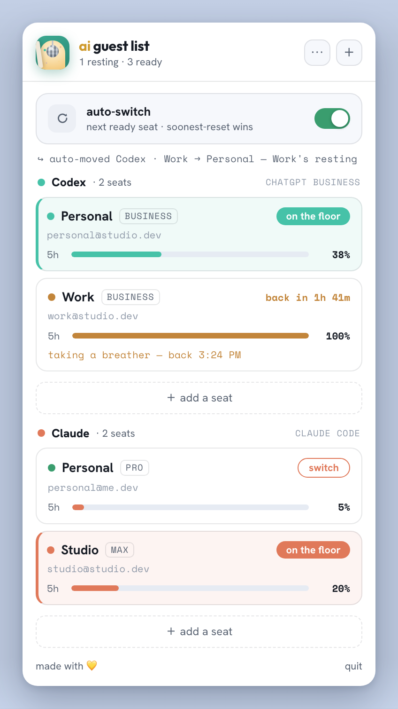
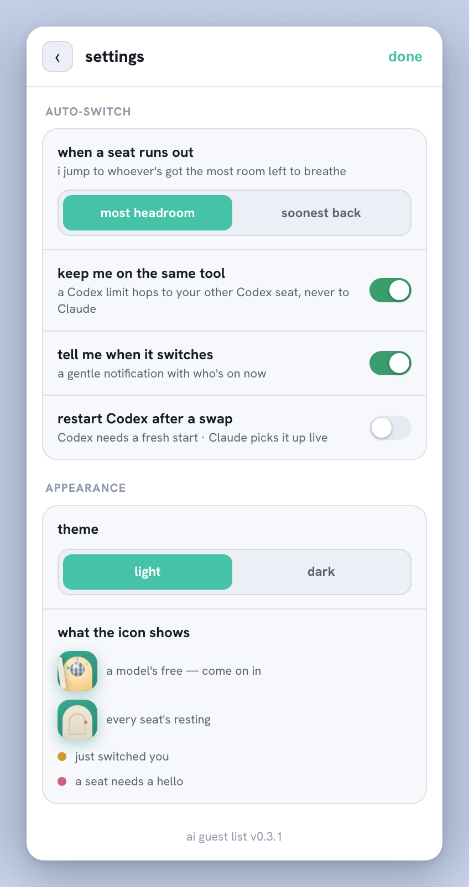

<p align="center">
  
</p>

<h1 align="center">ai guest list 🎟️</h1>

<p align="center">
  <b>Never stop coding because an AI agent hit its usage limit.</b><br>
  A lean macOS menubar app + CLI that <b>auto-switches between your Codex &amp; Claude accounts</b> when one
  runs out — resuming your work on the next seat.
</p>

<p align="center">
  <a href="https://github.com/fheinfling/ai-guest-list/actions/workflows/ci.yml"></a>
  <a href="https://codecov.io/gh/fheinfling/ai-guest-list"></a>
  <a href="https://github.com/fheinfling/ai-guest-list/releases/latest"></a>
  
  
  <a href="LICENSE"></a>
</p>

---

## What it is

If you pay for more than one AI-coding subscription — say two Codex seats, or Codex **and** Claude —
you've hit this: mid-task, the active account says *"you've reached your usage limit"* and you're
stuck until it resets. **ai guest list** treats each paid subscription as a **seat** on a guest list.
When the seat you're on runs out, it quietly **hops you to another seat of the same tool and resumes
the exact session** (`codex resume` / `claude --resume`) — so your agent keeps working. When every
seat is resting, it tells you which one **unlocks soonest**.

It's two thin pieces over your stock tools:
- a **menubar app** showing live usage + a one-glance status, and
- supervised `cx` / `cl` launchers that wrap stock `codex` / `claude` and do the hop for you.

Your stock `codex` / `claude` and their desktop apps keep working **untouched**. Credentials never
leave the **macOS Keychain** and the locations the official tools already read — nothing is uploaded
anywhere.

<p align="center">
  
  &nbsp;
  
  <br><sub><i>The menubar popover and its settings view — seats, live usage, auto-switch (sample accounts).</i></sub>
</p>

## Why

- **Stay on the floor.** Hit a limit → hop seats → resume — no manual re-login, no lost context.
- **Pick the smartest seat.** All seats resting? It chooses the one that unlocks soonest (or the one
  with the most headroom, your call).
- **Non-destructive & reversible.** A factory-image backup makes uninstall a clean restore.

## Features

- **Auto-switch on limit _or_ dead token** — rate-limited, or signed-out/revoked: it hops to a healthy
  same-tool seat and resumes your work; clear "sign in again" message when none is ready.
- **Live limits in the bar** — 5-hour + weekly usage and reset timers, read from the official usage
  endpoints (cached, gently polled).
- **Zero-touch setup** — installing the app wires `codex` / `claude` to the supervised launchers; when
  the app is closed they behave exactly like stock.
- **Add / remove seats** — official sign-in flow _or_ a no-browser path (Codex `auth.json`, Claude
  `setup-token`). Credentials live only in the Keychain.
- **Version & build** shown at the bottom of the settings view.

## Install

**Homebrew (easiest):**
```sh
brew install --cask fheinfling/tap/ai-guest-list
```
If Homebrew refuses the tap as untrusted, run `brew trust --tap fheinfling/tap` first, then retry.

Then launch **AI Guest List** from Spotlight or `/Applications`, click the menubar door, and **add your
seats**.

**Or download the app directly:**
1. Grab the latest `.app` from [**Releases**](https://github.com/fheinfling/ai-guest-list/releases/latest).
2. Unzip, drag **AI Guest List.app** to `/Applications`, and open it.

> **Unsigned-app note.** The app isn't signed/notarized yet, so macOS Gatekeeper blocks the first
> launch. After installing (brew or zip), either:
> - run `xattr -dr com.apple.quarantine "/Applications/AI Guest List.app"` (easiest), or
> - approve it: **macOS 15 (Sequoia)+** — open the app once, dismiss the dialog, then **System
>   Settings → Privacy & Security** → scroll down → **Open Anyway** (right-click → Open no longer
>   bypasses Gatekeeper on 15+); **macOS 14 and earlier** — right-click the app in `/Applications` →
>   **Open** → **Open**.

**From source (CLI engine):**
```sh
git clone https://github.com/fheinfling/ai-guest-list && cd ai-guest-list
python3 -m venv .venv && source .venv/bin/activate
pip install -e ".[app]"      # engine is stdlib-only; [app] adds the menubar deps
acctsw install               # set up the store + register your current seat
acctsw path                  # wire cx/cl into your shell (PATH + codex/claude aliases)
```
Then a plain `codex` / `claude` is supervised whenever the app is running.

## How it works

- `acctsw/` — the engine (Python, stdlib + the `security` CLI): credential swap, usage reading, seat
  selection, the supervised PTY launcher, install/uninstall.
- `app/` — the menubar app (`pyobjc` `NSStatusItem` + a `WKWebView` popover) — a thin UI over the engine.
- `cx` / `cl` — supervised launchers for `codex` / `claude`. **Stock binaries are never renamed or
  shadowed**; the app is the master switch — closed app ⇒ `cx`/`cl` run the real tool.

See [`docs/PLAN.md`](docs/PLAN.md) for the full design and [`docs/RELEASING.md`](docs/RELEASING.md) for
the release flow.

## Development

```sh
source .venv/bin/activate
pip install -e ".[app,dev]"
python -m pytest -q                 # Python suite
node --test app/web/*.test.mjs      # web-UI render tests
bash scripts/smoke.sh               # non-destructive end-to-end smoke
```
Build the app locally with `pip install -e ".[build]" && python setup.py py2app` (output in `dist/`).

## Safety & security

Credentials are only ever moved between the Keychain and the locations the official tools already read
— nothing is proxied off-device or committed to git. Writes are atomic and `0o600`.

> **Note.** Earlier versions had an optional "save credit" context-compression proxy (Headroom).
> Measuring it on real workloads showed the savings were negligible (~1–3% cache-adjusted) and not
> worth the proxy's fragility, so it was **removed**. The app cleans up any leftover routing on the
> next launch or `cx`/`cl` run. See [`docs/SECURITY-headroom.md`](docs/SECURITY-headroom.md).

## License

MIT — see [`LICENSE`](LICENSE).
