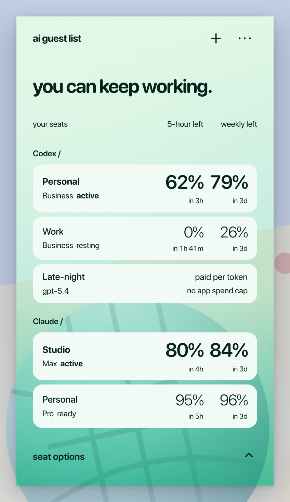
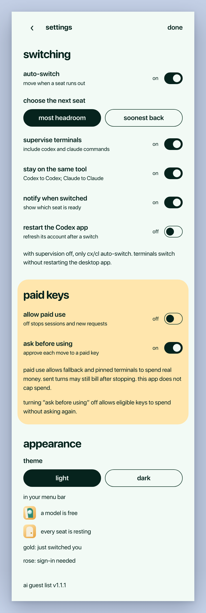

<p align="center">
  
</p>

<h1 align="center">ai guest list 🎟️</h1>

<p align="center">
  <b>Never stop coding because an AI agent hit its usage limit.</b><br>
  A lean macOS menubar app + CLI that <b>auto-switches between your Codex &amp; Claude accounts</b> when one
  runs out — resuming your work on the next seat.
</p>

<p align="center">
  <a href="https://github.com/fheinfling/ai-guest-list/actions/workflows/ci.yml"></a>
  <a href="https://codecov.io/gh/fheinfling/ai-guest-list"></a>
  <a href="https://github.com/fheinfling/ai-guest-list/releases/latest"></a>
  
  
  <a href="LICENSE"></a>
</p>

---

## What it is

If you pay for more than one AI-coding subscription — say two Codex seats, or Codex **and** Claude —
you've hit this: mid-task, the active account says *"you've reached your usage limit"* and you're
stuck until it resets. **ai guest list** treats each paid subscription as a **seat** on a guest list.
When the seat you're on runs out, it quietly **hops you to another seat of the same tool and resumes
the exact session** (`codex resume` / `claude --resume`) — so your agent keeps working. When every
seat is resting, it tells you which one **unlocks soonest** — or, if you've added an API key as a
seat, offers to carry on at pay-per-token rates once you approve it.

It's two thin pieces over your stock tools:
- a **menubar app** showing live usage + a one-glance status, and
- supervised `cx` / `cl` launchers that wrap stock `codex` / `claude` and do the hop for you.

Your stock `codex` / `claude` and their desktop apps keep working **untouched**. Saved credentials
stay in the **macOS Keychain** and the official tools’ credential stores.
The app talks directly to providers for sign-in, usage and model information; your coding sessions
connect through the official tools.

<p align="center">
  
  &nbsp;
  
  <br><sub><i>The shipping popover and settings, with fictional accounts. Views are expanded to show all content.</i></sub>
</p>

## Why

- **Stay on the floor.** Hit a limit → hop seats → resume — no manual re-login, no lost context.
- **Switch a running Codex session.** Click a seat's **switch** button (or run
  `acctsw switch codex EMAIL`) to restart supervised Codex in the same terminal and resume the
  conversation on that seat. Manual switching works even with auto-switch off. After updating,
  restart existing terminal launchers once so they load the new switching behavior.
- **Pick the smartest seat.** All seats resting? It chooses the one that unlocks soonest (or the one
  with the most headroom, your call).
- **Non-destructive & reversible.** A factory-image backup makes uninstall a clean restore.

## Features

- **Auto-switch on limit _or_ dead token** — rate-limited, out of credits, or signed-out/revoked: it
  hops to a healthy same-tool seat and resumes your work; clear "sign in again" message when none is
  ready. Limits are read from Codex's own session events and the usage API's own flags — not from
  screen text — so a reworded banner can't fool it. And if a seat is put to rest while you're working
  on it (the menubar's usage poll notices first), the *running* session hops too.
- **Live headroom in the bar** — how much of the 5-hour and weekly window each seat has **left**,
  read from the official usage endpoints, one row per seat with the active ones first. Both
  windows stay visible, and an unknown or stale reading says so rather than showing a zero. Active seats
  refresh every 30 seconds while the popover is open; background and parked-seat refreshes run
  every three minutes. Provider throttling backs off and keeps the last reading visibly stale.
- **Desktop switching** — the menubar moves a confirmed-limited seat to a verified healthy seat of
  the same tool when auto-switch is enabled. With “restart the Codex app after a swap” enabled, a running
  Codex desktop app quits gracefully and reopens; continue in your existing thread. Supervised
  terminal sessions resume automatically. Nearly full seats stay active until a confirmed limit.
- **Zero-touch setup** — installing the app wires `codex` / `claude` to the supervised launchers; when
  the app is closed they behave exactly like stock.
- **Add / remove seats** — official browser sign-in, plus a no-browser path for Codex (paste an
  `auth.json`). Claude is browser sign-in only: a `claude setup-token` is an env-var token, not the
  Keychain login the switcher reads. Credentials live only in the Keychain / the tools' own stores.
- **Pay-per-token key seats** — an API key becomes a seat too, for when every subscription is
  resting or when you want one terminal on a specific model. Paid use is off by default,
  and confirmation is on by default. One switch stops every paid session. See [below](#bring-your-own-key).
- **Version & build** shown at the bottom of the settings view.

## Bring your own key

Add a **key seat** and the guest list gains a pay-per-token option for when every subscription
seat is resting — or pin one terminal to it deliberately
with `cx --key <seat>`.

1. Open **add a seat → bring an api key instead** in the popover.
2. Choose a provider, paste your key, and pick a model from its catalog.
3. In settings, enable **allow paid key use**. Leave **ask before using a paid key** on to
   review paid use before it starts.
4. Click **use in new terminal** on the key seat, or let a supervised session offer it when
   its subscription seats are resting.

Key seats use your provider’s API billing, separately from your Codex or Claude subscription.

- **Providers** — OpenAI, Anthropic, OpenRouter, Langdock (eu/us/global, both its OpenAI and its
  Anthropic route) and any endpoint speaking the Responses API. A Chat-Completions-only provider is
  refused when you add it: Codex CLI requires Responses. Custom or unverified endpoints need
  explicit opt-in; the seat shows that support is unproven and offers a paid compatibility check.
- **Two harnesses, no new dependency** — a Responses key drives **Codex CLI**, an
  Anthropic-compatible one drives **Claude Code**. A key seat only takes over sessions of its own
  harness, so `codex resume` / `claude --resume` keep working and your work comes with you.
- **Prices where they exist** — the picker shows input/output $/Mtok and sorts cheap to expensive
  for providers that publish machine-readable prices. OpenAI, Anthropic and Langdock don't, so their
  models show **no price** and sort by id. Nothing is filled in from a bundled table that could
  quietly go stale.
- **Consent controls** — paid use starts disabled. With confirmation enabled (the default), each
  hop asks first, naming the seat, model and available price estimate, in the menubar even when
  the session is in a terminal. You can turn confirmation off in settings.
- **One switch stops it** — turning off *allow paid key use* halts new paid requests **and** any running paid
  session within a couple of seconds, leaving the work resumable.

> **This app does not cap your spend.** It shows available price estimates, asks before paid use
> by default, and stops when you tell it to. For a hard limit, use your provider's own budget controls. A turn
> already sent may still bill — the app says so rather than implying otherwise.

Langdock's EU routes keep **model requests** on the endpoint you picked. That is not the same as
"your code never reaches a US company": Langdock documents EU hosting on Microsoft Azure, and
pointing a session at it does not undo what an earlier session already sent elsewhere.

## Install

**Homebrew (easiest):**
```sh
brew install --cask fheinfling/tap/ai-guest-list
```
If Homebrew refuses the tap as untrusted, run `brew trust --tap fheinfling/tap` first, then retry.

Then launch **AI Guest List** from Spotlight or `/Applications`, click the menubar door, and **add your
seats**.

**Or download the app directly:**
1. Grab the latest `AI-Guest-List-v*.zip` from [**Releases**](https://github.com/fheinfling/ai-guest-list/releases/latest).
2. Unzip, drag **AI Guest List.app** to `/Applications`, and open it.

> **Unsigned-app note.** The app isn't signed/notarized yet, so macOS Gatekeeper blocks the first
> launch. After installing (brew or zip), either:
> - run `xattr -dr com.apple.quarantine "/Applications/AI Guest List.app"` (easiest), or
> - approve it: **macOS 15 (Sequoia)+** — open the app once, dismiss the dialog, then **System
>   Settings → Privacy & Security** → scroll down → **Open Anyway** (right-click → Open no longer
>   bypasses Gatekeeper on 15+); **macOS 14 and earlier** — right-click the app in `/Applications` →
>   **Open** → **Open**.

**Upgrading:** `brew upgrade --cask ai-guest-list` replaces the app on disk, but a menubar app that
is already running keeps the engine it started with. **Quit it from the menubar and open it again**
after upgrading, so the terminal and the app agree on how the store is laid out.

**From source (CLI engine):**
```sh
git clone https://github.com/fheinfling/ai-guest-list && cd ai-guest-list
python3 -m venv .venv && source .venv/bin/activate
pip install -e ".[app]"      # engine is stdlib-only; [app] adds the menubar deps
acctsw install               # set up the store + register your current seat
acctsw path                  # wire cx/cl into your shell (PATH + codex/claude aliases)
```
Then a plain `codex` / `claude` is supervised whenever the app is running.

To dedicate one terminal to a saved API-key seat, enable **allow paid key use** in settings,
then run `cx --key <seat-id>` or `cx --key "seat label"` (`cl --key` for Claude keys). Put `--key`
before agent arguments; for example, `cx --key "late-night" resume --last`. Labels match exactly;
an ambiguous label lists the ids to choose from. Each key card also offers **use in new terminal**.

The usual price estimate and paid-key confirmation still apply. Approval happens in the popover
when the app is open, or in the terminal when it is closed. Turning off confirmation records an
automatic approval; turning off paid use refuses new pins and stops running paid children.
Pins never change the selected subscription seat or hop back when a subscription frees up.
A currently pinned key is excluded from automatic fallback; additional explicit pins are allowed.

Each pinned terminal has its own **pinned · paid** row and **end** button. Ending one asks its child
to stop and flush, then copies only its conversation into the shared session history so you can
continue with `codex resume` on a subscription. Private originals are retained. **stop paid use**
ends all paid sessions; a turn already sent may still bill. Subscription children keep running.

## How it works

- `acctsw/` — the engine (Python, stdlib + the `security` CLI): credential swap, usage reading,
  limit signals from Codex's own session log (`acctsw/rollout.py`), seat selection, the supervised
  PTY launcher, install/uninstall.
- `app/` — the menubar app (`pyobjc` `NSStatusItem` + a `WKWebView` popover) — a thin UI over the engine.
- `cx` / `cl` — supervised launchers for `codex` / `claude`. **Stock binaries are never renamed or
  shadowed**; the app is the master switch for ordinary invocations — closed app ⇒ `cx`/`cl` run
  the real tool. An explicit `--key` pin stays supervised, including when the app is closed.

See [`docs/PLAN.md`](docs/PLAN.md) for the full design and [`docs/RELEASING.md`](docs/RELEASING.md) for
the release flow.

## Development

```sh
source .venv/bin/activate
pip install -e ".[app,dev]"
python -m pytest -q                 # Python suite
node --test app/web/*.test.mjs      # web-UI render tests
bash scripts/smoke.sh               # import check + both test suites
```
Build the app locally with `pip install -e ".[build]" && python scripts/build-web.py && python setup.py py2app`
(output in `dist/`). Regenerate the README images from the real UI with
`python scripts/screenshots.py` (requires Google Chrome), then inspect both images in `docs/assets/`.

## Safety & security

Credentials are only ever moved between the Keychain and the locations the official tools already read
— nothing is proxied off-device or committed to git. Writes are atomic and `0o600`.

**API keys.** A pasted key goes to the Keychain and nowhere else; the store keeps the provider, the
model and the last four characters. It reaches the agent through that child's environment — never a
command line, since `ps` is readable by anyone on the machine, and never a file. Key seats also
disable Codex's shell snapshots and scrub Claude's subprocess environment: without both, the harness
writes its own environment to disk and its shell tool can read the credential. That was a real leak,
found by running the thing rather than by a test — the write-up, including what is verified and what
isn't, is in
[`docs/VERIFY-keyhome-secret-containment.md`](docs/VERIFY-keyhome-secret-containment.md).

> **Note.** Earlier versions had an optional "save credit" context-compression proxy (Headroom).
> Measuring it on real workloads showed the savings were negligible (~1–3% cache-adjusted) and not
> worth the proxy's fragility, so it was **removed**. The app cleans up any leftover routing on the
> next launch or `cx`/`cl` run. See [`docs/SECURITY-headroom.md`](docs/SECURITY-headroom.md).

## License

MIT — see [`LICENSE`](LICENSE).
